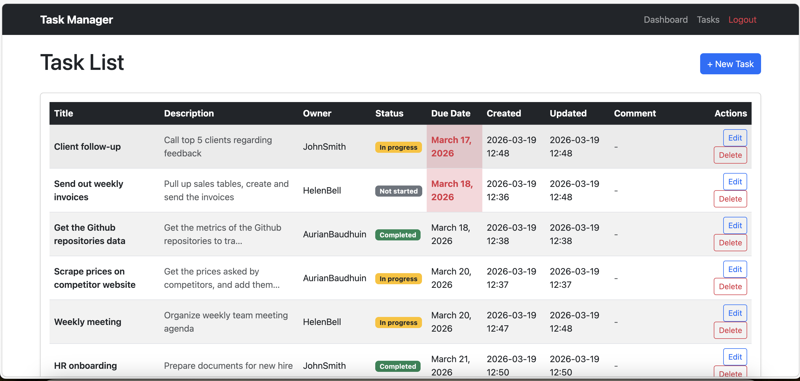
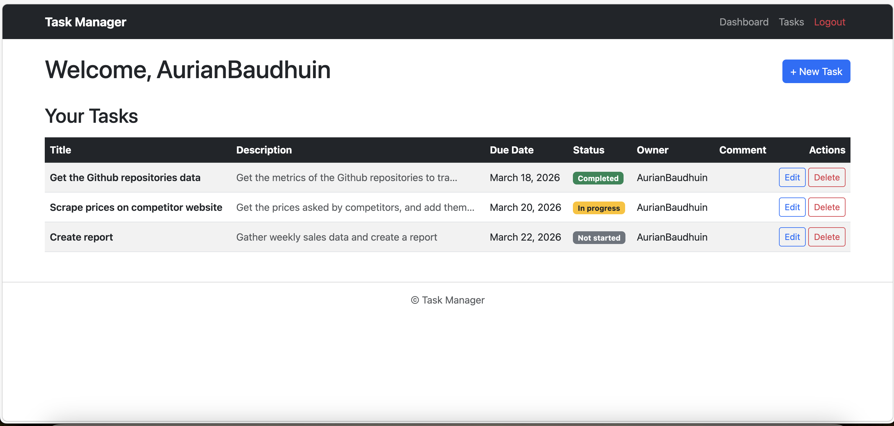
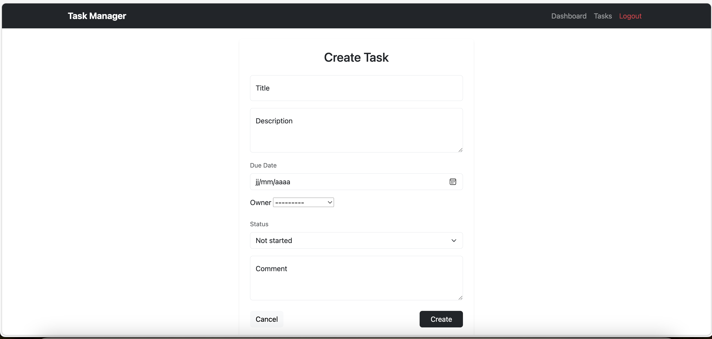
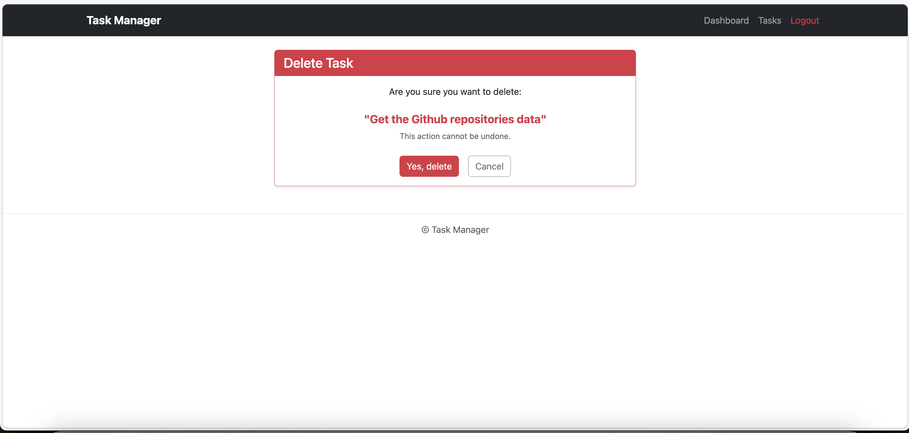

# task_manager
This project is a web-based Task Manager built with Django. It allows users to create, view, edit, and delete tasks, as well as track task deadlines and statuses. It demonstrates full CRUD functionality, user authentication, and a personalized dashboard for each user.

## Features
- User registration, login, and logout.
- Task creation, editing, and deletion.
- Tasks have a title, description, due date, status, owner, creation date, update date, and optional comments.
- Dashboard view showing the user’s tasks sorted by deadline, with overdue tasks visually highlighted.
- Status indication and overdue highlighting for tasks.
- Modern, responsive interface using Bootstrap for styling.

## Project structure
````
.
├── README.md
├── db.sqlite3
├── manage.py
├── requirements.txt
├── task_manager
│   ├── __init__.py
│   ├── __pycache__
│   ├── asgi.py
│   ├── settings.py
│   ├── urls.py
│   └── wsgi.py
└── tasks
    ├── __init__.py
    ├── __pycache__
    ├── admin.py
    ├── apps.py
    ├── forms.py
    ├── migrations
    ├── models.py
    ├── templates
    │   └── tasks
    │       ├── base.html
    │       ├── dashboard.html
    │       ├── delete_task.html
    │       ├── edit_task.html
    │       ├── task_form.html
    │       └── task_list.html
    ├── tests.py
    ├── urls.py
    └── views.py
````

## Technologies
- Python 3
- Django 6
- SQLite3 database
- Bootstrap 5 for front-end styling
- HTML templates with Django template language

## Pictures
Here are some visuals of the pages featured in this app:
- General tasks list:

- Personal dashboard:

- Task creation form:

- Task deletion:


## Possible improvements
Since this is a demo aimed at demonstrating knowledge of the Django framework, lots of features can be added or improved:
- Adding task priorities and tags
- Creating support for multiple teams
- More complexe profiles, supporting workplace hierarchy
- Integrating drag-and-drop task ordering
- Implement email reminders
- Add charts and productivity metrics
- Add messaging options, or multiple comments on every task
- ...

